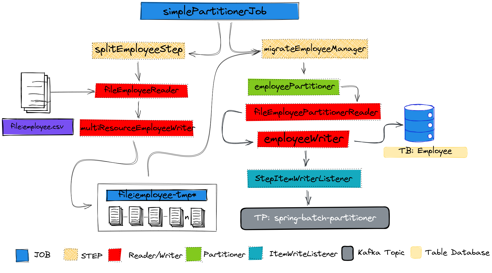

# Employee data migration
<hr>

#####This project which does a data migration from a CSV to a Databse, using local partitioner technique.

##Technologies Stack

- [**Docker**](https://www.docker.com/)
- [**Docker-compose**](https://github.com/docker/compose)
- [**Spring-Batch**](https://docs.spring.io/spring-batch/docs/current/reference/html/spring-batch-intro.html#spring-batch-intro)
- [**PostgresSQL**](https://www.postgresql.org/)
- [**Kafka**](https://kafka.apache.org/)
- [**Kafdrop**](https://github.com/obsidiandynamics/kafdrop)
- [**ZooKeeper**](https://zookeeper.apache.org/)


<hr>


##Installing Stack

Due to the fact the project is using Docker in it stack, 
we'll need install docker and docker-compose.
````
curl -fsSL https://get.docker.com | bash
````
But this command only install docker, if you is using Ubuntu or derivations,
you can run the code below.
````
sudo apt install docker-compose
````

## Running the stack
Now, you can easily up our tools.
````
sudo docker-compose up
````
Or
````
sudo docker-compose up -d
````
This way, we'll have the terminal free,
hawever we won't have tool logs. 

## Data Processing

<hr>




##Running the project

````

````
